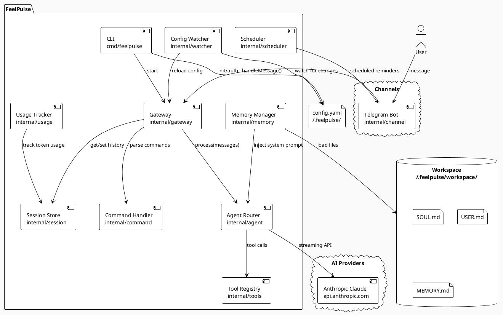
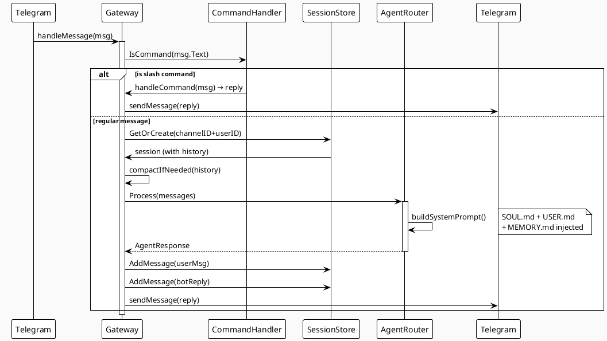
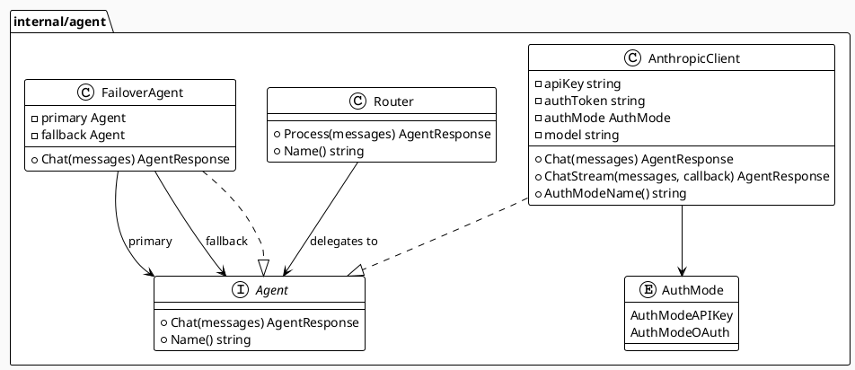
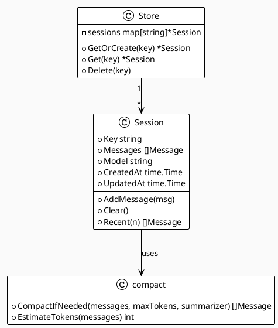
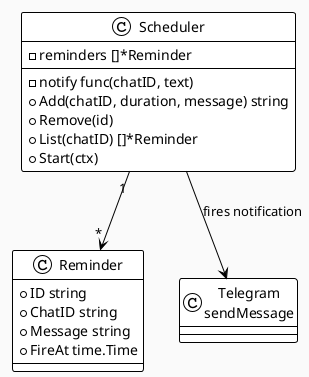
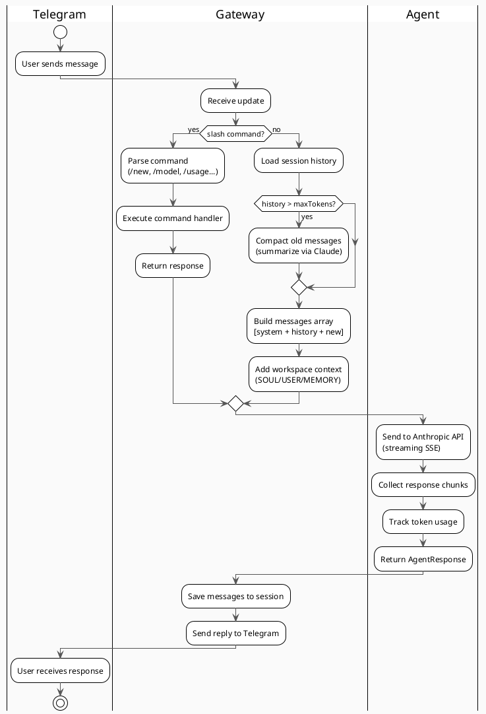
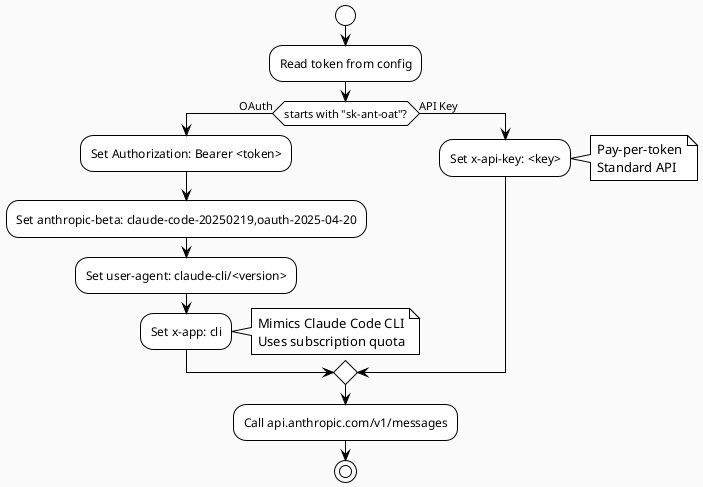

# FeelPulse Architecture

Fast, lightweight AI assistant platform written in Go. 3ms startup, minimal dependencies.

---

## Overview



---

## Component Details

### Gateway (`internal/gateway`)

The central orchestrator. Receives messages from channels, routes them through the pipeline, and sends responses back.



### Agent Router (`internal/agent`)

Manages AI provider clients, handles auth mode detection, streaming, and failover.



**Auth modes:**
- `AuthModeAPIKey` — standard `x-api-key` header (sk-ant-api...)
- `AuthModeOAuth` — subscription auth, mimics Claude Code headers (sk-ant-oat...)

### Session Store (`internal/session`)

In-memory conversation history, keyed by `channel:userID`.



**Compaction:** When conversation exceeds `maxContextTokens` (default 80k), older messages are summarized via a Claude API call and replaced with a single summary message.

### Memory Manager (`internal/memory`)

Loads workspace files and injects them into the system prompt.

```plantuml
@startuml memory
!theme plain
skinparam backgroundColor #FAFAFA

class Manager {
  -path string
  -soul string
  -user string
  -memory string
  +Load() error
  +BuildSystemPrompt(base string) string
}

rectangle "Workspace Files\n(~/.feelpulse/workspace/)" as WS #lightyellow {
  rectangle "SOUL.md\n(persona / AI identity)" as SOUL #fff2cc
  rectangle "USER.md\n(user context)" as USERF #fff2cc
  rectangle "MEMORY.md\n(long-term memory)" as MEMF #fff2cc
}

Manager --> SOUL : reads
Manager --> USERF : reads
Manager --> MEMF : reads
@enduml
```

**System prompt assembly order:**
1. `SOUL.md` content (persona override)
2. Base system prompt from `config.yaml`
3. `USER.md` section
4. `MEMORY.md` section

### Tool Registry (`internal/tools`)

Extensible tool system for function calling.

```plantuml
@startuml tools
!theme plain
skinparam backgroundColor #FAFAFA

class Registry {
  -tools map[string]*Tool
  +Register(tool)
  +Get(name) *Tool
  +List() []*Tool
  +Execute(name, params) string
}

class Tool {
  +Name string
  +Description string
  +Parameters []Parameter
  +Handler func(ctx, params) string
}

rectangle "web_search\n(DuckDuckGo / Brave)" as WS #dae8fc
rectangle "exec\n(Run shell commands)" as EX #dae8fc

Registry "1" --> "*" Tool
Tool --> WS : built-in
Tool --> EX : built-in
@enduml
```

### Scheduler (`internal/scheduler`)

Cron-style reminder system, runs in a background goroutine.



---

## Data Flow

### Message Processing Pipeline



### Authentication Flow



---

## Configuration

```yaml
# ~/.feelpulse/config.yaml
gateway:
  port: 18789
  bind: localhost

agent:
  provider: anthropic
  model: claude-sonnet-4-20250514
  apiKey: ""          # sk-ant-api-... (pay-per-token)
  authToken: ""       # sk-ant-oat-... (Claude subscription)
  maxTokens: 4096
  maxContextTokens: 80000
  system: "You are a helpful AI assistant."

workspace:
  path: ~/.feelpulse/workspace  # SOUL.md, USER.md, MEMORY.md

channels:
  telegram:
    enabled: true
    token: ""

hooks:
  enabled: true
  token: ""
  path: /hooks
```

---

## Directory Structure

```
feelpulse/
├── cmd/feelpulse/
│   └── main.go              # CLI entry point (start/init/auth/tui/status)
├── internal/
│   ├── agent/
│   │   ├── agent.go         # Router + Agent interface
│   │   ├── anthropic.go     # Anthropic client (API key + OAuth)
│   │   ├── failover.go      # Automatic model fallback
│   │   └── summarizer.go    # Conversation compaction helper
│   ├── channel/
│   │   └── telegram.go      # Telegram long-polling bot
│   ├── command/
│   │   └── command.go       # Slash command handler
│   ├── config/
│   │   └── config.go        # YAML config load/save
│   ├── gateway/
│   │   └── gateway.go       # Central message orchestrator
│   ├── hook/
│   │   └── hook.go          # Webhook HTTP handlers
│   ├── memory/
│   │   └── memory.go        # Workspace file loader
│   ├── scheduler/
│   │   └── scheduler.go     # Cron reminders
│   ├── session/
│   │   ├── session.go       # In-memory conversation store
│   │   └── compact.go       # Context compaction
│   ├── tools/
│   │   ├── tools.go         # Tool registry
│   │   └── builtins.go      # exec, web_search
│   ├── usage/
│   │   └── usage.go         # Token usage tracking
│   └── watcher/
│       └── watcher.go       # Config file hot-reload
├── pkg/types/
│   └── message.go           # Shared types (Message, AgentResponse)
├── docs/
│   └── architecture.md      # This file
├── TODO.md
├── Makefile
├── go.mod
└── README.md
```

---

## Available Commands

| Command | Description |
|---------|-------------|
| `make start` | Build and start (foreground) |
| `make start-bg` | Build and start (background) |
| `make stop` | Stop background process |
| `make restart` | Restart background process |
| `make logs` | Tail live logs |
| `make tui` | Launch terminal chat UI |
| `make auth` | Configure API key or setup-token |
| `make test` | Run all tests |
| `make dev` | Format + vet + build + start |

### Slash Commands (in Telegram)

| Command | Description |
|---------|-------------|
| `/new` | Start a new conversation |
| `/history [n]` | Show last n messages |
| `/model [name]` | Show or switch AI model |
| `/usage` | Token usage stats |
| `/remind in <duration> <msg>` | Set a reminder |
| `/reminders` | List active reminders |
| `/help` | Show all commands |
