# FeelPulse Architecture

Fast, lightweight AI assistant platform written in Go. 3ms startup, minimal dependencies.

**Stats:** ~25 packages, ~8000 lines of Go code

---

## Overview

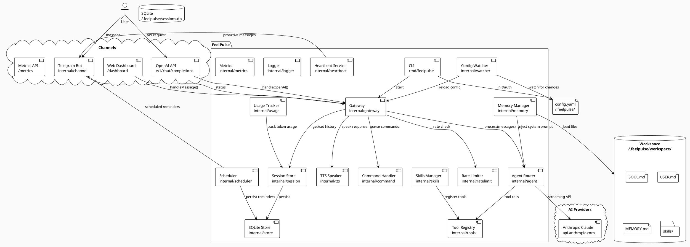

---

## Component Details

### Gateway (`internal/gateway`)

The central orchestrator. Receives messages from channels, routes them through the pipeline, and sends responses back.

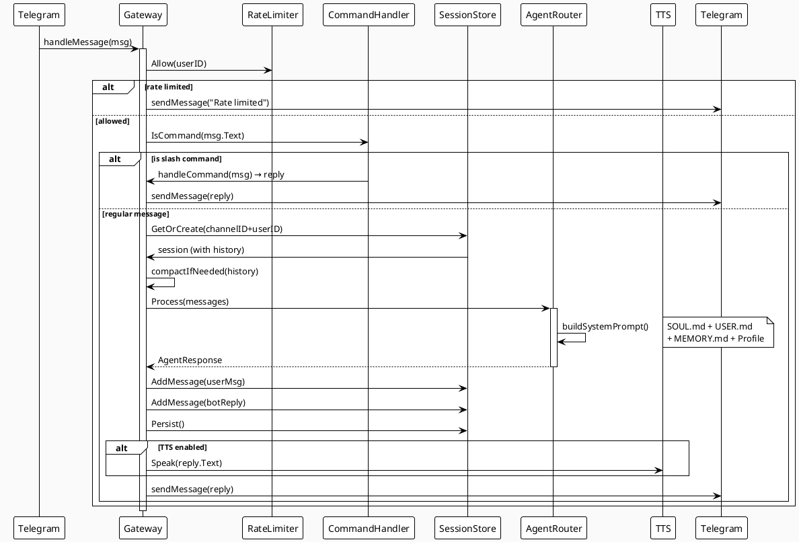

### Agent Router (`internal/agent`)

Manages AI provider clients, handles auth mode detection, streaming, and failover.

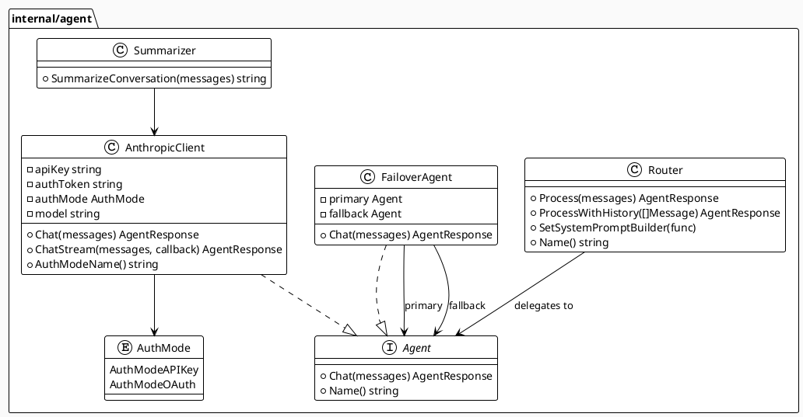

**Auth modes:**
- `AuthModeAPIKey` — standard `x-api-key` header (sk-ant-api...)
- `AuthModeOAuth` — subscription auth, mimics Claude Code headers (sk-ant-oat...)

### Session Store (`internal/session`)

In-memory conversation history with SQLite persistence, keyed by `channel:userID`.

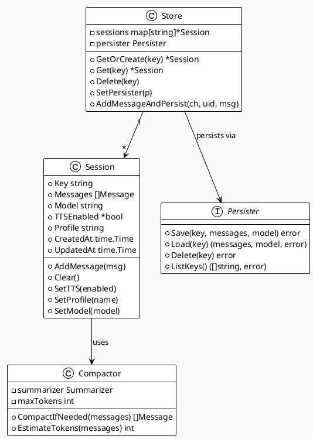

**Compaction:** When conversation exceeds `maxContextTokens` (default 80k), older messages are summarized via a Claude API call and replaced with a single summary message.

### SQLite Store (`internal/store`)

Persists sessions and reminders to SQLite database.

```plantuml
@startuml store
!theme plain
skinparam backgroundColor #FAFAFA

class SQLiteStore {
  -db *sql.DB
  +Save(key, messages, model) error
  +Load(key) (messages, model, error)
  +Delete(key) error
  +ListKeys() []string
  +SaveReminder(r) error
  +DeleteReminder(id) error
  +LoadReminders() []*ReminderData
  +CleanExpiredReminders() int64
}

database "sessions.db" as DB

note bottom of DB
  sessions: key, messages, model, updated_at
  reminders: id, channel, user_id, message, fire_at, created
end note

SQLiteStore --> DB : reads/writes
@enduml
```

### Memory Manager (`internal/memory`)

Loads workspace files and injects them into the system prompt.

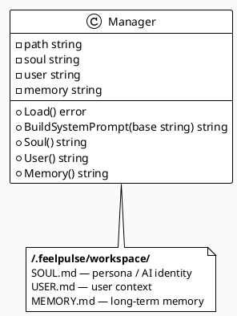

**System prompt assembly order:**
1. `SOUL.md` content (persona override)
2. Base system prompt from `config.yaml`
3. `USER.md` section
4. `MEMORY.md` section
5. Profile content (if `/profile use <name>`)

### Skills System (`internal/skills`)

Extensible tool system for function calling via SKILL.md files.

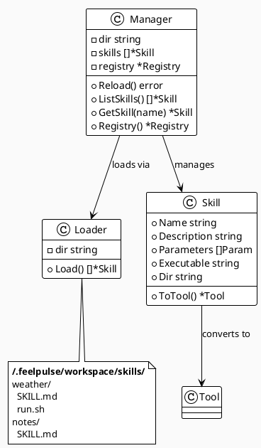

### Scheduler (`internal/scheduler`)

Persistent reminder system with SQLite backing.

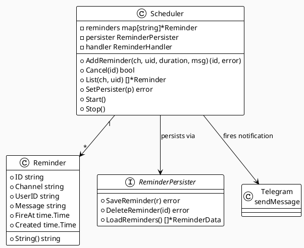

**Features:**
- `/remind in 30m call mom` — relative time
- `/remind at 14:30 meeting` — absolute time
- `/cancel <id>` — cancel by ID prefix
- Persists to SQLite (survives restarts)

### TTS Speaker (`internal/tts`)

Text-to-speech output with auto-detection.

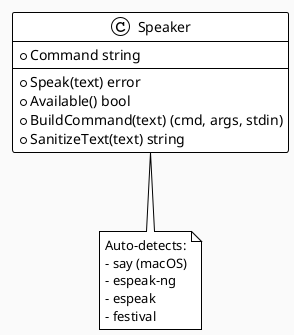

**Text sanitization:**
- Removes emoji, markdown, links
- Handles code blocks
- Collapses whitespace

### Heartbeat Service (`internal/heartbeat`)

Proactive periodic check system.

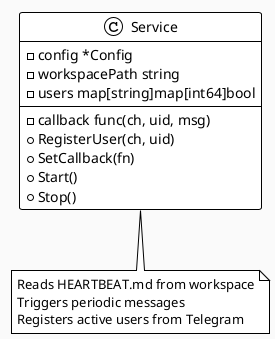

### Rate Limiter (`internal/ratelimit`)

Per-user message rate limiting.

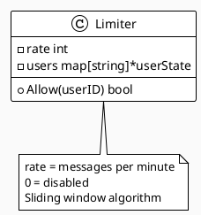

---

## Data Flow

### Message Processing Pipeline

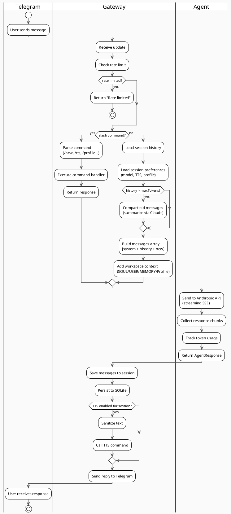

### Authentication Flow

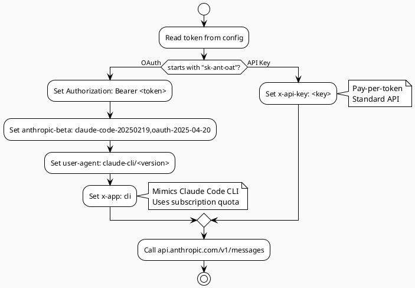

---

## Configuration

```yaml
# ~/.feelpulse/config.yaml
gateway:
  port: 18789
  bind: localhost

agent:
  provider: anthropic
  model: claude-sonnet-4-20250514
  apiKey: ""          # sk-ant-api-... (pay-per-token)
  authToken: ""       # sk-ant-oat-... (Claude subscription)
  maxTokens: 4096
  maxContextTokens: 80000
  rateLimit: 10       # messages per minute per user (0 = disabled)
  fallbackModel: claude-3-haiku-20240307
  system: "You are a helpful AI assistant."

workspace:
  path: ~/.feelpulse/workspace  # SOUL.md, USER.md, MEMORY.md
  profiles:
    friendly: ~/.feelpulse/workspace/friendly-soul.md
    professional: ~/.feelpulse/workspace/professional-soul.md

channels:
  telegram:
    enabled: true
    token: ""
    allowedUsers:       # empty = allow all
      - alice
      - bob

hooks:
  enabled: true
  token: ""
  path: /hooks

heartbeat:
  enabled: false
  intervalMinutes: 60

tts:
  enabled: false
  command: ""           # auto-detects: espeak, say, festival

browser:
  enabled: false        # Requires Chrome/Chromium
  headless: true
  timeoutSeconds: 30
  stealth: true

# Security settings for exec tool
tools:
  exec:
    enabled: false      # Disabled by default for security
    allowedCommands: [] # e.g. ["echo", "ls", "cat", "git"]
    timeoutSeconds: 30

# Logging
log:
  level: info           # debug, info, warn, error

# Admin commands
admin:
  username: ""          # Defaults to first allowedUser

# Metrics endpoint
metrics:
  enabled: true
  path: /metrics
```

---

## Directory Structure

```
feelpulse/
├── cmd/feelpulse/
│   ├── main.go              # CLI entry point
│   └── service.go           # systemd service management
├── internal/
│   ├── agent/
│   │   ├── agent.go         # Router + Agent interface
│   │   ├── anthropic.go     # Anthropic client (API key + OAuth)
│   │   ├── failover.go      # Automatic model fallback
│   │   └── summarizer.go    # Conversation compaction helper
│   ├── browser/
│   │   └── browser.go       # Browser automation (Chromedp)
│   ├── channel/
│   │   ├── telegram.go      # Telegram long-polling bot
│   │   └── keyboard.go      # Inline keyboards, bot commands
│   ├── command/
│   │   └── command.go       # Slash command handler
│   ├── config/
│   │   └── config.go        # YAML config load/save
│   ├── gateway/
│   │   ├── gateway.go       # Central orchestrator
│   │   ├── dashboard.go     # Web dashboard
│   │   └── openai.go        # OpenAI-compatible API
│   ├── heartbeat/
│   │   └── heartbeat.go     # Proactive check service
│   ├── logger/
│   │   └── logger.go        # Structured logging with levels
│   ├── memory/
│   │   └── memory.go        # Workspace file loader
│   ├── metrics/
│   │   └── metrics.go       # Prometheus-compatible metrics
│   ├── ratelimit/
│   │   └── limiter.go       # Per-user rate limiting
│   ├── scheduler/
│   │   └── scheduler.go     # Persistent reminders
│   ├── session/
│   │   ├── session.go       # Conversation store + branching
│   │   └── compact.go       # Context compaction
│   ├── skills/
│   │   └── skills.go        # SKILL.md loader + executor
│   ├── store/
│   │   └── sqlite.go        # SQLite persistence
│   ├── tools/
│   │   ├── tools.go         # Tool registry
│   │   └── builtins.go      # Built-in tools (exec, web_search)
│   ├── tts/
│   │   └── tts.go           # Text-to-speech
│   ├── tui/
│   │   └── model.go         # Terminal UI (bubbletea)
│   ├── usage/
│   │   └── usage.go         # Token usage tracking
│   └── watcher/
│       └── watcher.go       # Config file hot-reload
├── pkg/types/
│   └── message.go           # Shared types
├── docs/
│   ├── architecture.md      # This file
│   └── c4-architecture.md   # C4 model diagrams
├── TODO.md
├── Makefile
├── go.mod
└── README.md
```

---

## API Endpoints

| Endpoint | Method | Description |
|----------|--------|-------------|
| `/health` | GET | Health check with status |
| `/dashboard` | GET | Web status dashboard |
| `/v1/chat/completions` | POST | OpenAI-compatible API |
| `/hooks/*` | POST | Webhook handlers |
| `/metrics` | GET | Prometheus-compatible metrics |

---

## Telegram Commands

| Command | Description |
|---------|-------------|
| `/new` | Start a new conversation |
| `/history [n]` | Show last n messages |
| `/export` | Export conversation as .txt file |
| `/compact` | Manually compress conversation history |
| `/model [name]` | Show or switch AI model |
| `/models` | List available models |
| `/profile list` | List personality profiles |
| `/profile use <name>` | Switch to a profile |
| `/fork [name]` | Create conversation fork |
| `/sessions` | List your sessions |
| `/switch <name>` | Switch to session |
| `/tts on/off` | Toggle text-to-speech |
| `/skills` | List loaded AI tools |
| `/remind in <time> <msg>` | Set reminder (relative) |
| `/remind at <HH:MM> <msg>` | Set reminder (absolute) |
| `/reminders` | List active reminders |
| `/cancel <id>` | Cancel a reminder |
| `/usage` | Token usage stats |
| `/admin stats` | System statistics (admin only) |
| `/admin sessions` | All sessions (admin only) |
| `/admin reload` | Reload config (admin only) |
| `/help` | Show all commands |

---

## Metrics

Prometheus-compatible metrics at `GET /metrics`:

```
# HELP feelpulse_messages_total Total messages processed
# TYPE feelpulse_messages_total counter
feelpulse_messages_total{channel="telegram"} 42

# HELP feelpulse_tokens_total Total tokens used
feelpulse_tokens_total{type="input"} 12345
feelpulse_tokens_total{type="output"} 6789

# HELP feelpulse_active_sessions Current active sessions
feelpulse_active_sessions 3

# HELP feelpulse_tool_calls_total Tool calls by tool name
feelpulse_tool_calls_total{tool="web_search"} 10

# HELP feelpulse_tool_errors_total Tool errors by tool name
feelpulse_tool_errors_total{tool="exec"} 1
```

---

## Security

### Exec Tool Security

The exec tool (shell command execution) is **disabled by default** for security. To enable:

```yaml
tools:
  exec:
    enabled: true
    allowedCommands:    # Only these commands can run
      - echo
      - ls
      - cat
      - git
    timeoutSeconds: 30  # Command timeout
```

**Blocked patterns** (even if command is in allowlist):
- `rm -rf /`, `rm -rf ~`, `rm -rf $HOME`
- `sudo`, `su -`
- Path traversal (`../`)
- Piping to shell (`curl ... | sh`)
- Writing to `/etc/`, `/dev/`
- System commands (`reboot`, `shutdown`)

### Admin Commands

Admin commands restricted to configured admin user:

```yaml
admin:
  username: "alice"    # Defaults to first allowedUser
```
