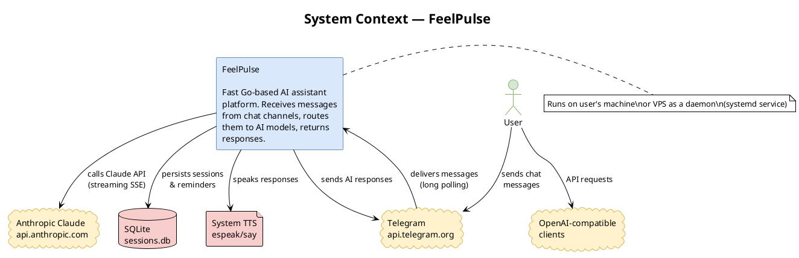
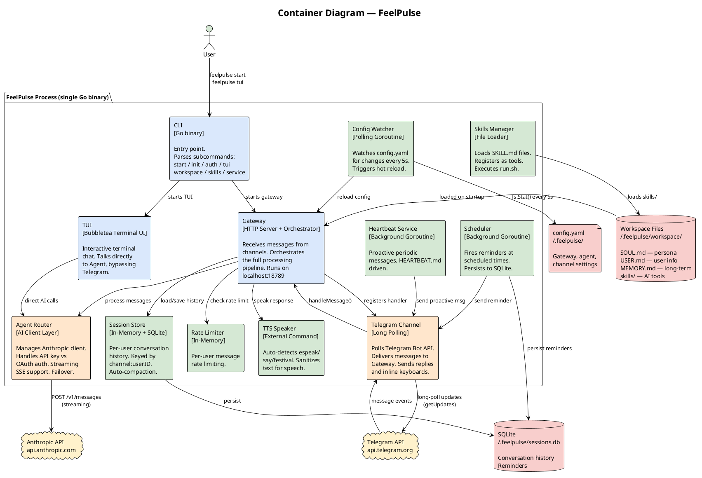
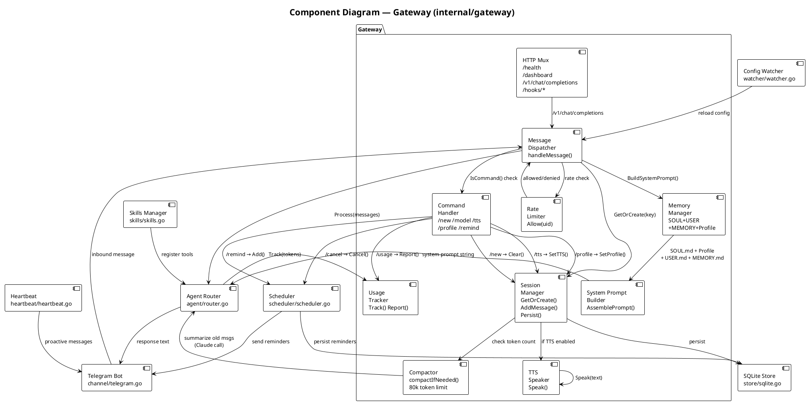
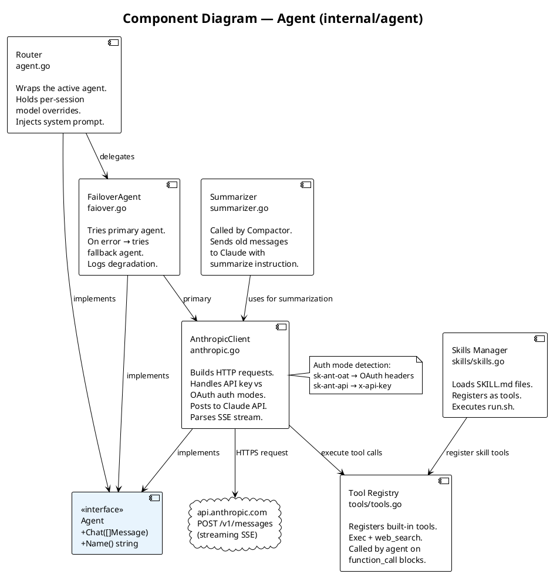
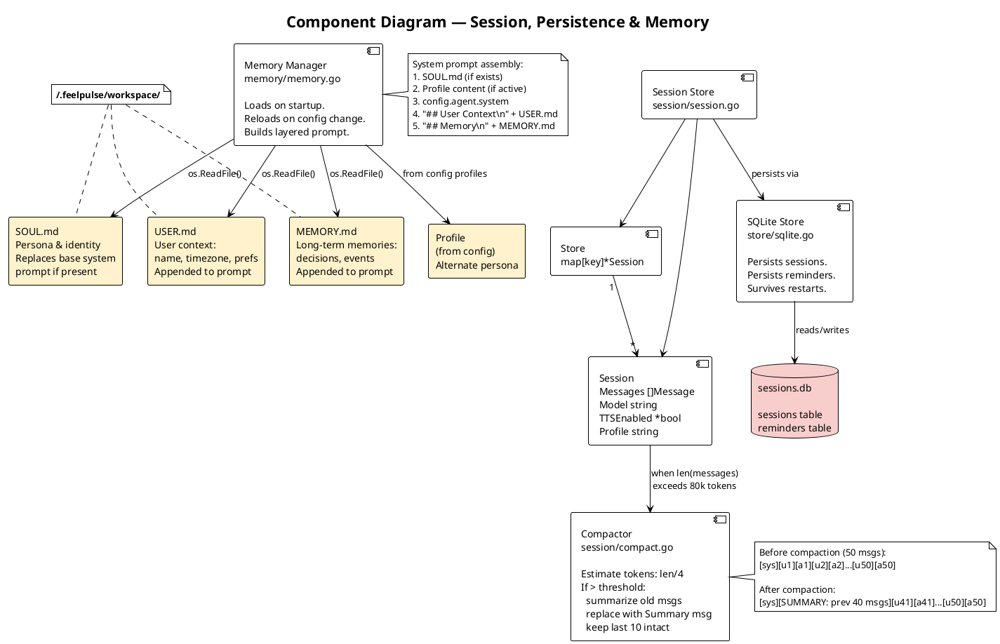
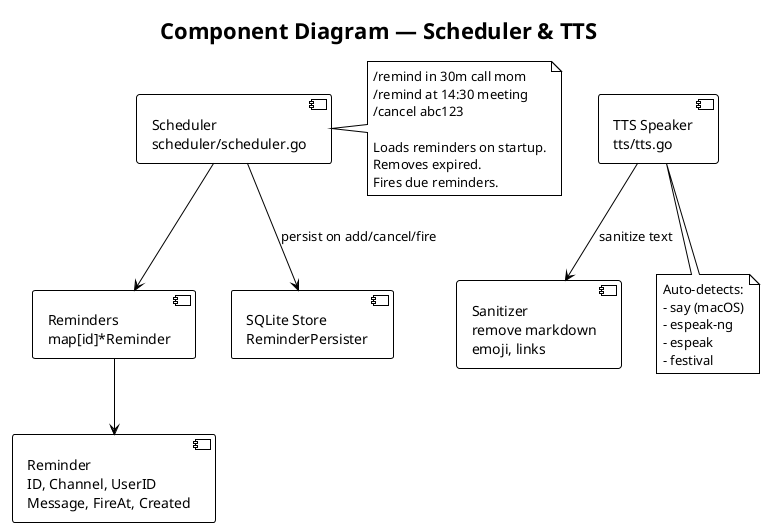
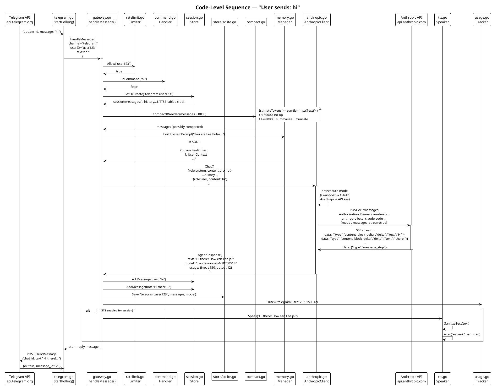
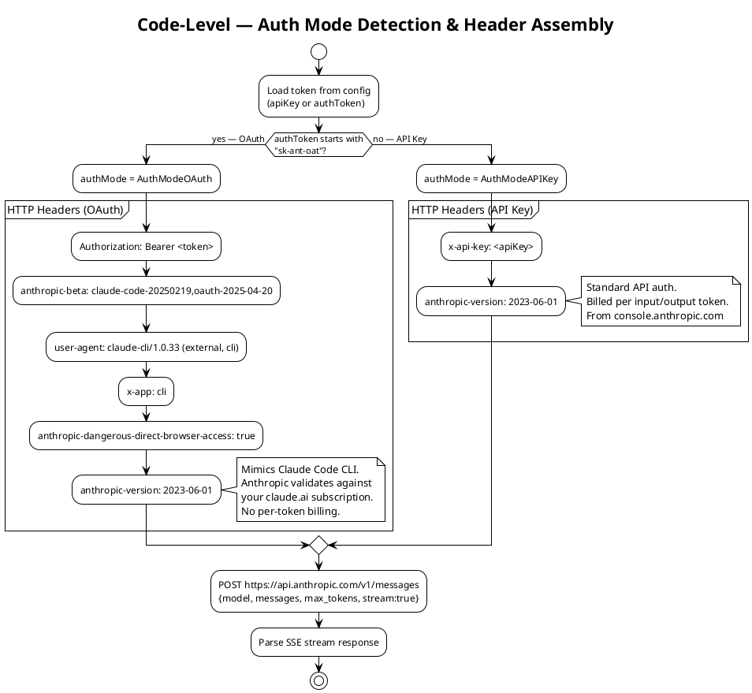

# FeelPulse — C4 Architecture

C4 Model: Context → Container → Component → Code

---

## Level 1: System Context

> Who uses FeelPulse and what external systems does it depend on?



**Core relationships:**
- User sends messages via Telegram → FeelPulse receives → calls Claude → replies to Telegram
- FeelPulse runs on user's local machine or VPS, not as a cloud service
- Sessions and reminders persist to SQLite database

---

## Level 2: Container Diagram

> What runnable units make up FeelPulse?



**Single-process architecture:** All components run in one Go process, communicating via function calls with zero IPC overhead.

---

## Level 3: Component Diagram — Gateway

> How do Gateway components work together?



---

## Level 3: Component Diagram — Agent Layer

> How does the Agent handle AI calls?



---

## Level 3: Component Diagram — Session & Persistence

> How do conversation history and persistence work?



---

## Level 3: Component Diagram — Scheduler & TTS

> How do reminders and text-to-speech work?



---

## Level 4: Code — Message Processing Sequence

> Full code path from Telegram message to Claude and back



---

## Level 4: Code — Auth Flow

> Code differences between two authentication methods



---

## System Design Principles

| Principle | Implementation |
|-----------|----------------|
| **Single-process** | All components in one Go process, zero IPC overhead |
| **SQLite persistence** | Sessions and reminders survive restarts |
| **Streaming responses** | Claude SSE stream → process while generating |
| **Hot reload** | config.yaml changes → watcher detects → auto-reload |
| **Layered prompts** | SOUL → Profile → system → USER → MEMORY stacked |
| **Auto-compaction** | Over 80k tokens → summarize old messages |
| **Subscription auth** | Mimic Claude Code headers → use subscription quota |
| **3ms startup** | Native Go binary, no JVM/V8 startup overhead |
| **Per-session state** | Model, TTS, Profile stored per conversation |
| **Skills extensibility** | SKILL.md + run.sh = custom AI tools |
| **Structured logging** | Log levels (DEBUG/INFO/WARN/ERROR), request IDs |
| **Prometheus metrics** | /metrics endpoint for observability |
| **Exec sandboxing** | Disabled by default, allowlist-only execution |
| **Session branching** | /fork + /sessions + /switch for conversations |
| **Admin commands** | /admin stats/sessions/reload (restricted) |

---

## New Components (Round 4)

### Logger (`internal/logger`)

Structured logging with levels:

```go
// Log levels: DEBUG, INFO, WARN, ERROR
// Format: 2026-02-17 16:00:00 INFO [gateway] Processing message from user123
log := logger.New(&Config{Level: "info", Component: "gateway"})
log.Info("Processing message from %s", username)

// With request context
reqLog := log.WithRequestID("user123")
reqLog.Debug("Session loaded: %d messages", len(messages))
```

### Metrics (`internal/metrics`)

Prometheus-compatible metrics:

```go
metrics.IncrementMessages("telegram")
metrics.AddTokens(inputTokens, outputTokens)
metrics.SetActiveSessions(sessionStore.Count())
metrics.IncrementToolCall("web_search")
```

### Admin Commands

```
/admin stats     — goroutines, memory, uptime
/admin sessions  — all active sessions
/admin reload    — hot-reload config + workspace
```

Restricted to `admin.username` or first `allowedUsers` entry.

### Session Branching

```
/fork [name]     — create copy of conversation
/sessions        — list main + forked sessions
/switch <name>   — change active session
```

In-memory fork with full history copy.
