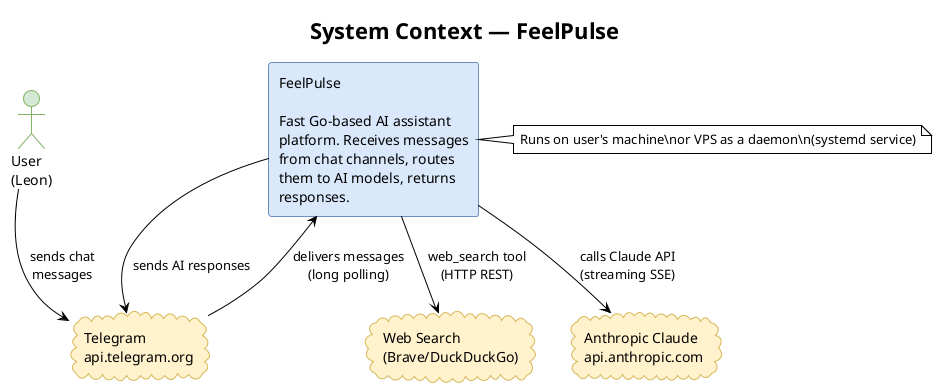
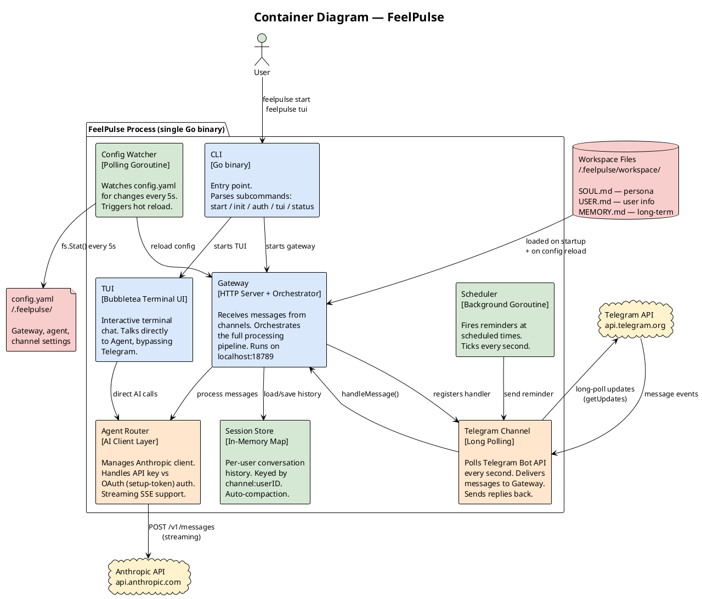
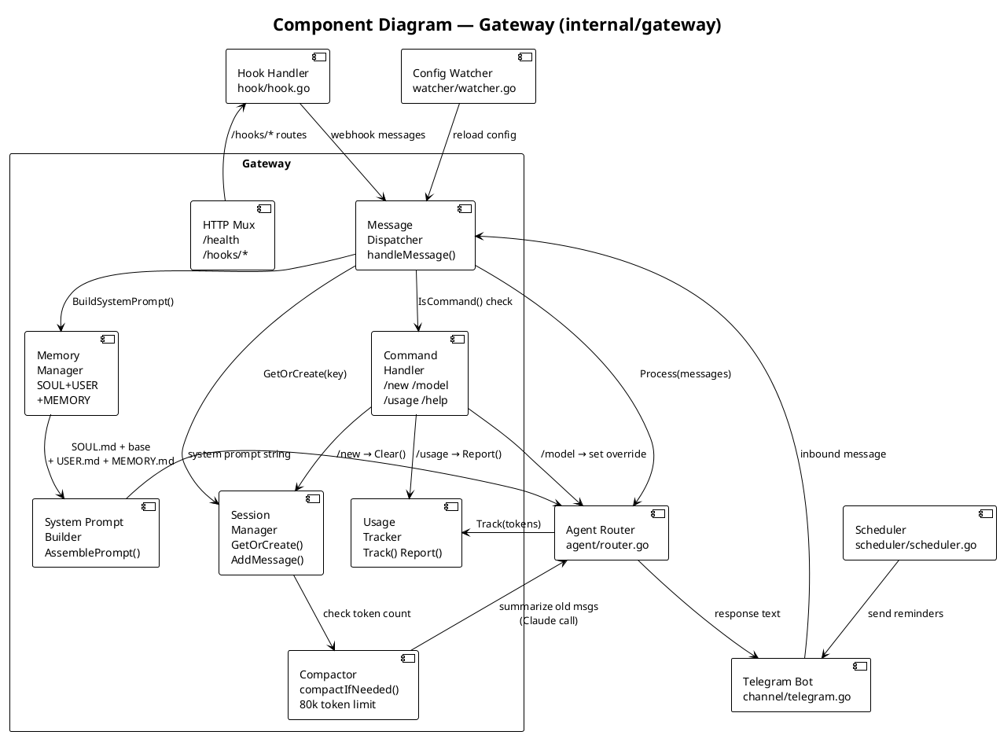
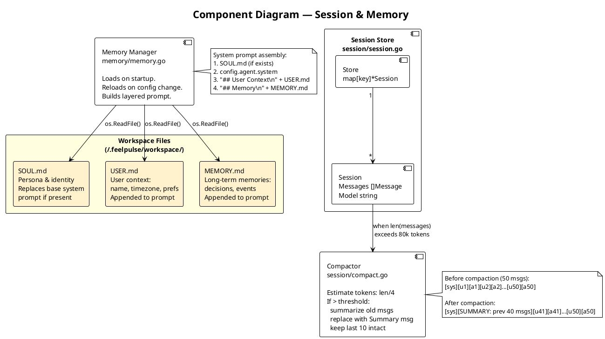
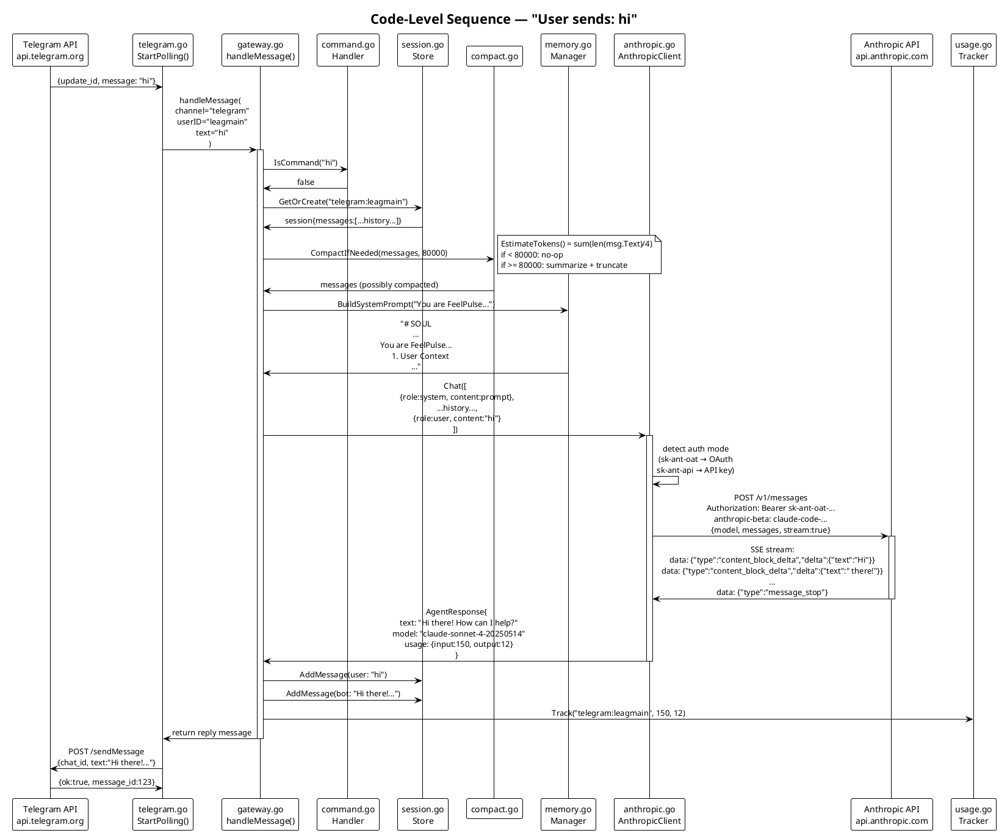
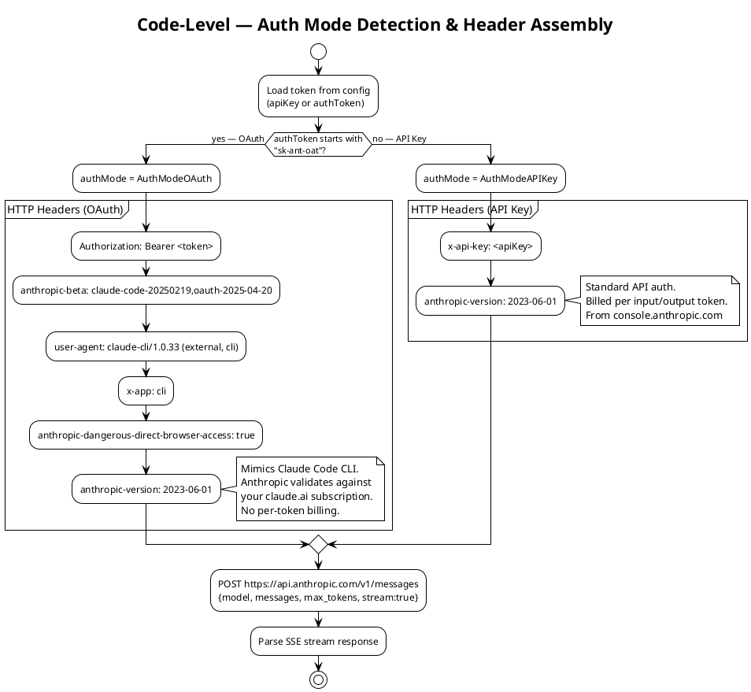

# FeelPulse — C4 Architecture

C4 Model: Context → Container → Component → Code

---

## Level 1: System Context

> 谁在使用 FeelPulse，它依赖哪些外部系统？



**核心关系：**
- User 通过 Telegram 发消息 → FeelPulse 接收 → 调用 Claude → 回复给 Telegram
- FeelPulse 运行在用户本地或 VPS，不是云服务

---

## Level 2: Container Diagram

> FeelPulse 内部由哪些可运行的单元组成？



**单进程架构：** 所有组件在同一个 Go 进程中运行，通过函数调用通信，无 IPC 开销。

---

## Level 3: Component Diagram

> Gateway 内部各组件如何协作？



---

## Level 3: Component Diagram — Agent Layer

> Agent 如何处理 AI 调用？

```plantuml
@startuml c4-agent
!theme plain
skinparam backgroundColor #FFFFFF
skinparam defaultFontName monospace

title Component Diagram — Agent (internal/agent)

interface "Agent\ninterface" as IFACE {
  +Chat([]Message) AgentResponse
  +Name() string
}

component "Router\nagent.go\n\nWraps the active agent.\nHolds per-session\nmodel overrides." as ROUTER

component "AnthropicClient\nanthropic.go\n\nBuilds HTTP requests.\nHandles API key vs\nOAuth auth modes.\nPosts to Claude API.\nParses SSE stream." as ACLIENT

component "FailoverAgent\nfaiover.go\n\nTries primary agent.\nOn error → tries\nfallback agent.\nLogs degradation." as FAILOVER

component "Summarizer\nsummarizer.go\n\nCalled by Compactor.\nSends old messages\nto Claude with\nsummarize instruction." as SUMM

component "Tool Registry\ntools/tools.go\n\nRegisters built-in tools.\nExec + web_search.\nCalled by agent on\nfunction_call blocks." as TOOLS

cloud "api.anthropic.com\nPOST /v1/messages\n(streaming SSE)" as ANT

ROUTER ..|> IFACE : implements
ACLIENT ..|> IFACE : implements
FAILOVER ..|> IFACE : implements

ROUTER --> FAILOVER : delegates
FAILOVER --> ACLIENT : primary
ACLIENT --> ANT : HTTPS request
ACLIENT --> TOOLS : execute tool calls
SUMM --> ACLIENT : uses for summarization

note right of ACLIENT
  Auth mode detection:
  sk-ant-oat → OAuth headers
  sk-ant-api → x-api-key
end note
@enduml
```

---

## Level 3: Component Diagram — Session & Memory

> 对话历史和记忆系统如何工作？



---

## Level 4: Code — Message Processing Sequence

> 一条消息从 Telegram 到 Claude 再回到用户的完整代码路径



---

## Level 4: Code — Auth Flow

> 两种认证方式的代码差异



---

## 系统设计原则

| 原则 | 实现 |
|------|------|
| **单进程** | 所有组件在同一 Go 进程，零 IPC 开销 |
| **无持久化** | Session 在内存，重启清空（设计选择：简单 > 复杂） |
| **流式响应** | Claude SSE stream → 边生成边处理 |
| **可热重载** | config.yaml 改变 → watcher 检测 → 自动重载 |
| **分层 Prompt** | SOUL → base system → USER → MEMORY 依次叠加 |
| **自动压缩** | 超过 80k token → 旧消息摘要化，保持上下文可控 |
| **订阅认证** | 伪装 Claude Code headers → 用 Claude 订阅额度，不额外付费 |
| **3ms 启动** | Go 原生二进制，无 JVM/V8 启动开销 |
